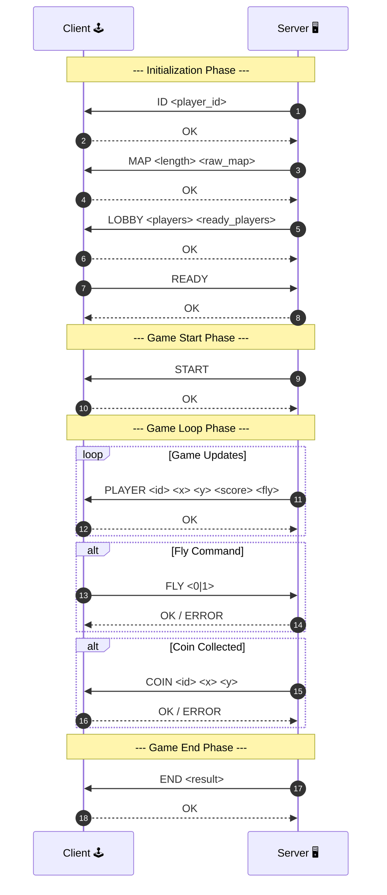

# Client-Server architecture

The **Client** and the **Server** communicate following this diagram 

### Data sent from Server to Client

`ID <player_id>`: Sends a unique player ID to the client.

`MAP <length> <raw_map>`: Sends the map data, including its length and raw map representation.

`LOBBY <players> <ready_players>`: Sends the list of players and the count of ready players.

`START`: Signals the start of the game.

`PLAYER <id> <x> <y> <score> <fly>`: Sends player updates, including ID, position (x, y), score, and fly status.

`COIN <id> <x> <y>`: Sends information about a coin collected, including its ID and position.

`END <result>`: Sends the final result of the game.

`OK / ERROR`: The server responds with either an OK or ERROR message based on the success of the command (e.g., FLY, COIN).

### Data sent from Client to Server

`OK`: Acknowledges receipt of data (e.g., ID, MAP, LOBBY), this tell the server that no occured during packet transmition

`READY`: Sends the information that the client is ready to play

`FLY <0|1>`: Sends a command to indicate whether the player is flying (1) or not (0).

### Error Handling

When the server don't receive `OK` from the client, it will resend the last packet until it receives the `OK` message. This is done to ensure that the client has received all necessary data and is in sync with the server.

When the client don't receive `OK` from the server on `READY`, it will notify the user and will not send the `READY` command again. This is to prevent the server to start the game without being ready itself. 

If the client sends a `FLY` command and the server responds with an `ERROR`, the client will display an error message to the user. The server will continue as if it received `FLY 0` (not flying) and will update the player according to this state.

If the server sends a `COIN` command and the client responds with an `ERROR`, the server will resend the `COIN` command until it receives an `OK` message. This ensures that the server is aware of the coin collection status and can update the game state accordingly.